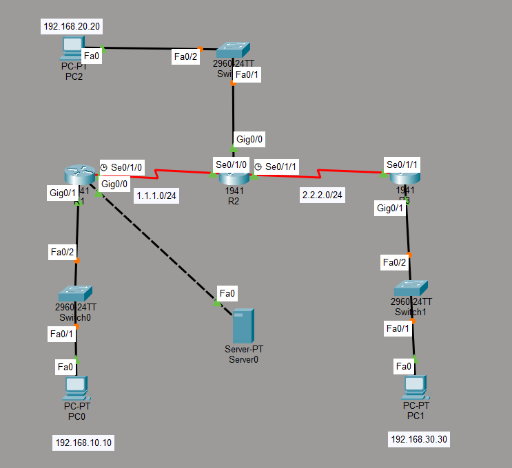

# Kurumsal Ağ Topolojisi ve RIPv2 Yönlendirme Simülasyonu

Bu proje, Cisco Packet Tracer üzerinde üç yönlendiriciden (router) oluşan bir kurumsal ağ mimarisinin baştan sona tasarlanması, dinamik yönlendirme (RIPv2) ile haberleştirilmesi ve güvenli bir şekilde dış dünyaya (internete) açılmasını simüle etmektedir. 

## 🚀 Proje Özeti
Proje kapsamında üç farklı yerel ağ (LAN), seri bağlantılarla (WAN) birbirine bağlanmıştır. Ağın kendi içinde otomatik olarak yol bulabilmesi (dinamik yönlendirme) için RIPv2 protokolü kullanılmıştır. Ayrıca ağın internete erişimi için varsayılan bir rota (Default Route) oluşturulmuş ve LAN bacaklarında ağ güvenliği ile bant genişliği optimizasyonları yapılmıştır.

## 📖 Temel Kavramlar: RIPv2 Nedir?
**RIP (Routing Information Protocol)**, ağdaki yönlendiricilerin birbirlerini otomatik olarak tanımasını ve veri paketlerinin hedefe giderken en kısa yolu seçmesini sağlayan bir **Uzaklık-Vektör (Distance-Vector)** yönlendirme protokolüdür. 

* **Metrik (Hop Count):** Hedefe ulaşmak için kaç adet router'dan (sekme) geçilmesi gerektiğini sayar. Maksimum 15 sekmeyi destekler.
* **Neden Versiyon 2 (RIPv2)?** RIP'in ilk versiyonu Alt Ağ Maskelerini (Subnet Mask) desteklemezdi. Versiyon 2 ile birlikte VLSM (Değişken Uzunluklu Alt Ağ Maskesi) desteği gelmiş ve güncellemeler tüm ağa yayın (broadcast) yapmak yerine çoklu yayın (multicast - 224.0.0.9) ile daha verimli ve güvenli hale getirilmiştir.

## 🗺️ Ağ Topolojisi Detayları

Ağ üzerinde toplam 5 farklı alt ağ (subnet) ve 1 adet dış ağ bağlantısı (internet simülasyonu) bulunmaktadır:

**Yerel Ağlar (LAN):**
* **Şube 1 (R1):** `192.168.10.0/24`
* **Şube 2 (R2):** `192.168.20.0/24`
* **Şube 3 (R3):** `192.168.30.0/24`

**Geniş Alan Ağları (WAN):**
* **R1 - R2 Arası:** `1.1.1.0/24` (DCE/DTE Serial Link)
* **R2 - R3 Arası:** `2.2.2.0/24` (DCE/DTE Serial Link)

**Dış Bağlantı:**
* **Dış Sunucu (Server):** `209.165.200.225` (R1 üzerinden dış ağ simülasyonu)

## ⚙️ Kritik Yapılandırma Komutları ve Arkasındaki Mantık

Bu topolojinin sorunsuz ve güvenli çalışmasını sağlayan en kritik 3 yapılandırma adımı şunlardır:

### 1. Sınıfsız Yönlendirme: `no auto-summary`
* **Komut:** `Router(config-router)# no auto-summary`
* **Neden Kullanıldı?** RIP varsayılan olarak IP adreslerini sınıflarına (A, B, C sınıfı) göre özetleme eğilimindedir. Örneğin `2.2.2.0/24` ağını otomatik olarak A sınıfı olan `2.0.0.0/8` şeklinde özetleyip diğer cihazlara böyle tanıtır. Bu durum alt ağların (subnet) kaybolmasına ve paketlerin yanlış hedeflere gitmesine (Routing Loop/Blackhole) sebep olur. Bu komut, özetlemeyi kapatarak ağların tam olarak tasarlandığı alt ağ maskeleriyle (`/24`) iletilmesini sağlar.

### 2. Ağ Güvenliği ve Optimizasyon: `passive-interface`
* **Komut:** `Router(config-router)# passive-interface gigabitEthernet 0/1`
* **Neden Kullanıldı?** RIP, yapılandırıldığı tüm arayüzlerden her 30 saniyede bir yönlendirme güncellemeleri gönderir. Ancak LAN bacaklarında (GigabitEthernet) sadece son kullanıcı bilgisayarları (PC) bulunur. Bu komut sayesinde kullanıcı tarafına gereksiz RIP paketleri gönderilmesi durdurulur. 
* **Güvenlik Faydası:** Hem gereksiz bant genişliği tüketimi önlenir hem de yerel ağdaki kötü niyetli bir kullanıcının ağa sahte RIP paketleri enjekte ederek yönlendirme tablolarını zehirlemesi (Route Poisoning / Spoofing) engellenmiş olur.

### 3. Dış Dünyaya Açılış: `default-information originate`
* **Komut:** `Router(config-router)# default-information originate`
* **Ön Koşul:** `ip route 0.0.0.0 0.0.0.0 209.165.200.224` (R1'e yazılan Statik Varsayılan Rota)
* **Neden Kullanıldı?** R1 cihazı dış dünyaya (internete) nasıl çıkılacağını bilmektedir ancak iç ağdaki R2 ve R3 bu yolu bilmez. Bu komut, R1'in RIP güncellemelerinin içine "Eğer hedefi bilinmeyen bir paketin varsa (internete gidecekse) onu bana gönder" bilgisini otomatik olarak eklemesini sağlar. Böylece ağdaki tüm cihazlar internet erişimi kazanır.

## 🧪 Kurulum ve Test

Bu projeyi kendi ortamınızda incelemek için:
1. Depodaki `.pkt` uzantılı dosyayı **Cisco Packet Tracer** ile açın.
2. Bilgisayarların (PC) komut satırından diğer LAN'lardaki cihazlara veya `209.165.200.225` numaralı dış sunucuya `ping` atarak uçtan uca erişimi test edin.
3. Router arayüzlerinde yönlendirme tablolarını incelemek için CLI üzerinden `show ip route` komutunu kullanın. Tabloda RIP ile öğrenilen rotaları (`R`) ve dış dünyaya açılan aday rotayı (`R*`) görebilirsiniz.
